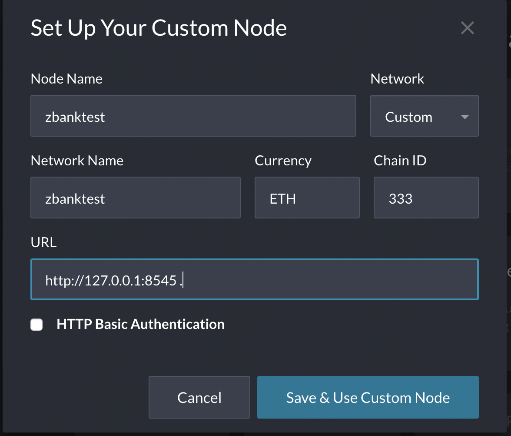

## zbank-blockchain
# Running a Proof of Authority Blockchain

The following document outlines the steps taken to create a private blockchain to fullfill testing requirements used by zbank internally. 

# Creating nodes 
Creation of two new nodes with new account addresses that will serve as our pre-approved sealer addresses.

Create accounts for two nodes for the network with a separate `datadir` for each using `geth`.
        * `./geth --datadir node1 account new`
        * `./geth --datadir node2 account new`

.
#  Create new genesis block for Zbank

    * Run `./puppeth' in the Blockchain folder with the new network name 'zbanktest' whilst selecting the option to configure a new genesis block. Note: No special characters or caps can be used in the network name. 

    * Create `Clique (Proof of Authority)`.

    * Addresses created in Node 1 and Node 2 inserted into the list of accounts to seal.

    * Same accounts should be identified to pre-fund as there are no block rewards in PoA, so  pre-fundin is required.

    * No pre-funding of the pre-compiled accounts is required. This keeps the genesis cleaner.

    * Once the prompts are completed the new genisis block has been created. 

    * Export genesis configurations is now required to be created. This will create a local zbanktest.json file in the Blockchain folder. 

    
# Initialize the nodes with the genesis' json file

    * Using `geth`, initialize each node with the new `zbanktest.json`.
        * `./geth --datadir node1 init zbanktest.json`
        * `./geth --datadir node2 init zbanktest.json`

    

# Now the nodes can be used to begin mining blocks.

    * Run the nodes in separate terminal windows with the commands:
        ./geth --datadir node1 --unlock "0xf952F00338323497DE64CCfd39973A538B8bF1aB" --mine --rpc --allow-insecure-unlock

        ./geth --datadir node2 --unlock "0x0a502ae66AC7F6fa13cb633D12e690fa7FE4089A" --mine --port 30304 --bootnodes "enode://bc4f5fc06ec72030a10aa9c4e41110252f5839671dd70b555d82a2232d22bd17b803864dbc617a2b93b91013f668df248d2123bdb1c3c5cd800aca3579fe023e@127.0.0.1:30303" --ipcdisable --allow-insecure-unlock

    

### NOTE:** Type your password and hit enter - even if you can't see it visually! 

    

The private PoA zbanktest blockchain is now running!

    

## Adding zbanktest blockchain to MyCrypto for testing.

   
    * Click "Add Custom Node", then add the custom network information that wast set in genesis.

        

    * Click `Save & Use Custom Node` and view wallet 

  

## Testing zbank test in MyCrypto.

    * Select the `View & Send` option from the left menu pane, then click `Keystore file`.

    * On the next screen, click `Select Wallet File`, then navigate to the keystore directory inside your Node1 directory, select the file located there, provide your password when prompted and then click `Unlock`.

    * This will open your account wallet inside MyCrypto. 

 **We are rich!!**
    

    

    * In the `To Address` box, type the account address from Node2, then fill in an arbitrary amount of ETH of 100,000

    

    * Confirm the transaction by clicking "Send Transaction", and the "Send" button in the pop-up window.  

    

    * Click the `Check TX Status` when the green message pops up, confirm the logout:

    

    * You should see the transaction go from `Pending` to `Successful` in around the same blocktime you set in the genesis.

      
